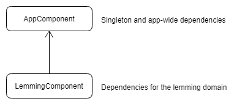

# Android Dagger 2 Tutorial

This guide explains how to use Dagger 2 in Android.
I will go through the simple setup, 
explain what the dependency graphs are and how to provide custom annotations.

You can find the final code in my GitHub repository:

[https://github.com/matthiasbruns/android-dagger2-tutorial](https://github.com/matthiasbruns/android-dagger2-tutorial)

## Project Setup

I use Android Studio 3 Canary 7 in this tutorial.

In this tutorial we will use the following libraries:

* Dagger 2 [https://github.com/google/dagger](https://github.com/google/dagger)

Create two productFlavors which we'll use later to show, how Dagger can improve injection based on
external settings.

````groovy
flavorDimensions "connectivity"
productFlavors {
    offline {
        dimension "connectivity"
    }

    online {
        dimension "connectivity"
    }
}
````

The resulting build.gradle can be found here:

[https://github.com/matthiasbruns/android-dagger2-tutorial/blob/master/app/build.gradle](https://github.com/matthiasbruns/android-dagger2-tutorial/blob/master/app/build.gradle)

Since we use the annotationProcessor, be sure to activate "Annotation Processing" in Android Studio.


## Intro

This guide is all about Dagger. To show you some advantages which come with dependency injection,
I created some fake app model. We will have a LemmingsRepository, which *loads* Lemmings from somewhere.
We will also have a Lemming model, which stores the lemming data. 

## Lemming

````java
/**
 * Simple pojo which stores some lemming data
 */
public class Lemming {

    /**
     * Age of the lemming in years
     */
    private int mAge;

    /**
     * Id of the lemming provided by the data store
     */
    private int mId;

    /**
     * Yes - lemmings have names
     */
    private String mName;

    /**
     * How fast can you go?
     */
    private int mSpeed;
    
    // Getters & Setters
}
````

A simple pojo which stores data of a lemming in a class.

## LemmingRepository

A repository is a source of data. You can provide an interface of a repository and implement as many 
repositories as you want. 

This example is incomplete and does not provide ways to handle asynchronous datasources as REST endpoints.

If you want to know more about repositories and how to implement them correctly, have a look at my other guide:

[https://medium.com/@mtrax/android-kotlin-clean-architecture-with-mvpvm-6c46e3c92a60](https://medium.com/@mtrax/android-kotlin-clean-architecture-with-mvpvm-6c46e3c92a60)

We will _implement_ two repositories:

* LemmingCacheRepository
* LemmingRestRepository

````java
/**
 * Simple interface to provide the implementation of the repository pattern.
 * THIS IS A SIMPLIFIED VERSION OF A REPOSITORY!
 * EVERYTHING WILL EXECUTE SYNCHRONOUSLY!
 */
public interface Repository<T, ID> {

    /**
     * Loads all objects of T
     */
    List<T> all();

    /**
     * Delets T by id if present
     */
    void delete(@NonNull final ID id);

    /**
     * Loads an object of T by its id if present
     */
    @Nullable
    T get(@NonNull final ID id);

    /**
     * Stores T in the datasource
     */
    void insert(@NonNull final T t);

    /**
     * Updates T by its id in the datasource
     */
    void update(@NonNull final T t);
}
````

The Repository is a base interface which allows implementing classes to define the model and id class.
It provides the usual CRUD operations.

````java
/**
 * The base interface which can be implemented to provide access to lemming data.
 */
public interface LemmingRepository extends Repository<Lemming, Integer> {
}
````

The LemmingRepository defines the datatypes of the model and id generics.

````java
/**
 * The LemmingCacheRepository uses stores lemmings in memory.
 */
public class LemmingCacheRepository implements LemmingRepository {

    /**
     * Our Cache.
     */
    @SuppressLint("UseSparseArrays")
    private Map<Integer, Lemming> mLemmingHashMap = new HashMap<>();

    /**
     * Gets all lemmings from the cache
     */
    @Override
    public List<Lemming> all() {
        return new ArrayList<>(mLemmingHashMap.values());
    }

    /**
     * Deletes a lemming by its id from the cache.
     */
    @Override
    public void delete(@NonNull final Integer integer) {
        mLemmingHashMap.remove(integer);
    }

    /**
     * Returns the lemming by its id.
     */
    @Override
    @Nullable
    public Lemming get(@NonNull final Integer integer) {
        return mLemmingHashMap.get(integer);
    }

    /**
     * Adds a new lemming into the cache
     */
    @Override
    public void insert(@NonNull final Lemming lemming) {
        mLemmingHashMap.put(lemming.getId(), lemming);
    }

    /**
     * Updates a cached lemming by its id
     */
    @Override
    public void update(@NonNull final Lemming lemming) {
        // Cheap - I know - is enough for this example
        mLemmingHashMap.put(lemming.getId(), lemming);
    }
}
````

The LemmingCacheRepository implements the LemmingRepository and stores the lemming data in memory.
Again - don't expect that this implementation is good or working - it is just an example.

````java
/**
 * This lemming repository communicates with a rest service.
 */
public class LemmingRestRepository implements LemmingRepository {

    /**
     * Example object
     */
    private static final Lemming LEMMING = new Lemming();

    /**
     * Loads all lemmings from the rest service.
     */
    @Override
    public List<Lemming> all() {
        return new ArrayList<>();
    }

    /**
     * Deletes a lemming from the rest service.
     */
    @Override
    public void delete(@NonNull final Integer integer) {
        // do something online
    }

    /**
     * Returns a lemming by its id from the rest service.
     */
    @Nullable
    @Override
    public Lemming get(@NonNull final Integer integer) {
        return LEMMING;
    }

    /**
     * Adds a lemming to the rest service.
     */
    @Override
    public void insert(@NonNull final Lemming lemming) {
        // Send to the interwebs
    }

    /**
     * Updates a lemming by its id in the rest service
     */
    @Override
    public void update(@NonNull final Lemming lemming) {
        // Send to the interwebs
    }

    /**
     * Fills our fake lemming with data
     */
    static {
        LEMMING.setId(1);
        LEMMING.setName("FAKE");
        LEMMING.setAge(99);
        LEMMING.setSpeed(9000);
    }
}
````

The counter part to the cache repository is the LemmingRestRepository, which *communicates* with 
a rest api.


## Dagger 2

### Terminology

Dagger uses components and modules.
A components combines modules into a set of dependency providers.
Each module knows how to provide certain dependencies.
Components should be used per domain and have defined lifecycles.

### Dependency Graph

Let's start to prepare the dependency graph. But what is the dependency graph?
Dagger has no predefined structure and inheritance rules. You as a developer can decide which 
components depend on other components, what dependencies live during a component's lifetime and which should
be recreated each injection.



This is how the components depend on each other.  The AppComponents creates singletons and app-wide dependencies.
The LemmingComponents provides dependencies for the lemming domain.

### ApplicationConfig

````java
/**
 * Stores runtime settings for this app.
 * You could also put the settings into the {@link android.content.SharedPreferences},
 * but we won't do this for this example.
 */
public class ApplicationConfig {

    /**
     * Flag is online features are allowed or not
     */
    private boolean mOnlineAllowed;

    public boolean isOnlineAllowed() {
        return mOnlineAllowed;
    }

    public void setOnlineAllowed(final boolean onlineAllowed) {
        mOnlineAllowed = onlineAllowed;
    }
}
````

This class is used during injection to decide if some injection results use online or offline features.
It will be used later during the AppComponent creation.

### AppComponent

````java
/**
 * This components act as the app wide dependency component for this app.
 * It provides repositories and configs.
 */
@Singleton
@Component(modules = {AppModule.class, RepositoryModule.class})
public interface AppComponent {

    /**
     * Allows components which depend on this component to use the
     * {@link ApplicationConfig} managed in here.
     */
    ApplicationConfig config();

    /**
     * Injects dependencies into the {@link DaggerApplication} class
     */
    void inject(@NonNull final DaggerApplication application);

    /**
     * Allows components which depend on this component to use the
     * {@link LemmingRepository} managed in here.
     */
    LemmingRepository lemmingRepository();
}
````

The AppComponent uses two modules:

* AppModule
* RepositoryModule

### AppModule

The AppModule provides the application context and the ApplicationConfig, which are both stored as
a singleton in the AppComponent. To allow other components which depend on the AppComponent to access
the ApplicationConfig and the LemmingRepository in this component, we have to define two methods:

* ApplicationConfig config()
* LemmingRepository lemmingRepository()

If we wouldn't define the methods, the LemmingComponent would receive new instances of both components.
This would be a problem for the ApplicationConfig, because we need to have the same information in all
classes. 

The inject method describes, who is allowed to receive dependencies from this component. 
In this case, only the DaggerApplication can be injected.

````java
/**
 * This module provides app-wide dependencies.
 */
@Module
public class AppModule {

    /**
     * The application this module belongs to
     */
    @NonNull
    private final DaggerApplication mApplication;

    public AppModule(@NonNull final DaggerApplication application) {
        mApplication = application;
    }

    /**
     * The application context of this app as a Singleton
     */
    @Provides
    @Singleton
    Context provideApplicationContext() {
        return mApplication;
    }

    /**
     * The application config of this app as a Singleton
     */
    @Provides
    @Singleton
    ApplicationConfig providesApplicationConfig() {
        return new ApplicationConfig(mApplication);
    }

    /**
     * The {@link DaggerApplication} of this app as a Singleton
     */
    @Provides
    @Singleton
    DaggerApplication providesDaggerApplication() {
        return mApplication;
    }
}
````

The AppModule provides the application context, DaggerApplication and the ApplicationConfig.
Each of them are provided as a singleton. 
The @Singleton annotation is the same as the one in the AppComponent. If the component's annotation
and the provides annotation match, the created object is treated as a singleton in this component.
If you leave out the annotation in the provide methods, every time when there is an injection the module
creates a new instance of the class.

### RepositoryModule

````java
/**
 * This module provides repositories for this app.
 */
@Module
public class RepositoryModule {

    /**
     * The {@link LemmingRepository} can have multiple implementations.
     * Based on the {@link ApplicationConfig} the returned implementation can differ.
     */
    @Provides
    @Singleton
    LemmingRepository provideLemmingRepository(@NonNull final ApplicationConfig config) {
        if (config.isOnlineAllowed()) {
            return new LemmingRestRepository();
        }
        return new LemmingCacheRepository();
    }
}
````

The repository module decides, which repository will be injected. In our case we have a boolean flag
in our config, which marks, if the online mode is enabled or not. The ApplicationConfig is injected
by dagger. Since this module is used in the AppComponent, it receives the singleton config object
provided by the AppModule above.

### DaggerApplication

````java
/**
 * Main entry point of this app.
 * Prepares dependency injection.
 */
public class DaggerApplication extends Application {

    /**
     * The ApplicationConfig is used to manage app-wide settings.
     */
    @NonNull
    @Inject
    protected ApplicationConfig mApplicationConfig;

    /**
     * The app-wide {@link AppComponent}.
     */
    @NonNull
    private AppComponent mComponent;

    /**
     * Helper to get the {@link DaggerApplication} from the application context.
     */
    @NonNull
    public static DaggerApplication application(@NonNull final Context context) {
        return (DaggerApplication) context.getApplicationContext();
    }

    /**
     * The dagger {@link AppComponent} which other components can use to depend on.
     */
    public AppComponent component() {
        return mComponent;
    }

    @Override
    public void onCreate() {
        super.onCreate();

        // Initialize the dependency graph
        mComponent = DaggerAppComponent.builder()
                .repositoryModule(new RepositoryModule())
                .appModule(new AppModule(this))
                .build();

        // Inject dependencies (ApplicationConfig) into this class
        mComponent.inject(this);

        // Decide, if we can use online features or not
        mApplicationConfig.setOnlineAllowed(BuildConfig.FLAVOR.contains("online"));
    }
}
````

The DaggerApplication class prepares the Dagger dependency graph. It initializes the AppComponent
and decides, if the app should use online features or not. If another component depends on this
AppComponent, it can receive the created AppComponent through:

````java
/**
 * The dagger {@link AppComponent} which other components can use to depend on.
 */
public AppComponent component() {
    return mComponent;
}
````

The AppComponent uses two modules, which need to be created during the component creation:

````java
// Initialize the dependency graph
mComponent = DaggerAppComponent.builder()
        .repositoryModule(new RepositoryModule())
        .appModule(new AppModule(this))
        .build();
````

### LemmingComponent

After we've prepared our AppComponent, we can start building other domain components.
The LemmingComponent provides all dependencies required in the lemming domain of this app.

````java
/**
 * A domain based components to provide required dependencies for the lemmings domain. Depends on
 * {@link AppComponent} to receive the {@link com.matthiasbruns.dagger2.config.ApplicationConfig} as
 * a Singleton
 */
@ActivityScope
@Component(dependencies = AppComponent.class, modules = ActivityModule.class)
public interface LemmingComponent {

    /**
     * Injects dependencies into the {@link LemmingActivity}
     */
    void inject(LemmingActivity activity);

}
````

As you can see, we've marked this component as ActivityScoped. Since we depend on a Singleton-scoped
component (AppComponent), Dagger forces us to create a new annotation with a weaker scope. Dagger
can detect by itself, which annotations are weaker than others and builds an internal graph based 
on this information.

````java
/**
 * A custom scope used to mark a component as activity scoped.
 */
@Scope
@Retention(RetentionPolicy.RUNTIME)
public @interface ActivityScope {
}
````

Each scope annotation looks like this and the only thing that differs is the name of the annotation.

Let's head back to the LemmingComponent. This component uses one module - the ActivityModule and
allows the LemmingActivity to be injected by this component.

### ActivityModule

````java
/**
 * This module injects dependencies important for activities.
 */
@Module
public class ActivityModule {

    /**
     * The activity which belongs to this module
     */
    @NonNull
    private final Activity mActivity;

    public ActivityModule(@NonNull final Activity activity) {
        mActivity = activity;
    }

    /**
     * Provides the activity context
     */
    @Provides
    @ActivityScope
    Context provideContext() {
        return mActivity;
    }

    /**
     * Provides a title suffix for the app
     *
     * @param config required to decide which title to use
     */
    @Provides
    @Named("titleSuffix")
    @ActivityScope
    String provideTitleSuffix(@NonNull final ApplicationConfig config) {
        if (config.isOnlineAllowed()) {
            return " - Online";
        }
        return " - Offline";
    }
}
````

The ActivityModule provides a String method to show in an exemplary way, how you can decide which
object to return based on app settings.
In our out of the question useful example, we return "Online" or "Offline" based in the isOnlineAllowed()
method in the ApplicationConfig. 

A new annotation is introduced here

````java
@Named("titleSuffix")
````

Dagger decides which method to call when injecting by its return type. If you have two methods with 
the same return type, you have to name them by adding a @Named annotation. In the class, which receives
the injected objects, you need to add @Named() to the @Inject annotation to tell Dagger what to inject.

### LemmingAcitivity

````java
/**
 * Example activity, which displays the class name of the injected {@link LemmingRepository}
 */
public class LemmingActivity extends AppCompatActivity {

    /**
     * Required to load lemming data.
     * Has to be injected.
     */
    @Inject
    protected LemmingRepository mLemmingRepository;

    /**
     * Indicator which displayed what version we use
     */
    @Inject
    @Named("titleSuffix")
    protected String mTitleSuffix;

    @Override
    protected void onCreate(Bundle savedInstanceState) {
        super.onCreate(savedInstanceState);

        // Create the LemmingComponent and inject this activity
        DaggerLemmingComponent.builder()
                .appComponent(DaggerApplication.application(this).component())
                .activityModule(new ActivityModule(this))
                .build().inject(this);

        // Initialize the layout
        setContentView(R.layout.activity_main);

        // Set the content of the TextView to be the class name of the injected LemmingRepository
        ((TextView) findViewById(R.id.text)).setText(mLemmingRepository.getClass().getSimpleName());

        // Add the title suffix to the activity title
        setTitle(getTitle() + mTitleSuffix);
    }
}
````

We inject two object into this activity

````java
@Inject
protected LemmingRepository mLemmingRepository;

@Inject
@Named("titleSuffix")
protected String mTitleSuffix;
````
The LemmingRepository is provided by the AppModule in the AppComponent.
The mTitleSuffix String comes from the ActivityModule in the LemmingComponent.
Since the LemmingComponent depends in the AppComponent and the AppComponent allows
the LemmingComponent to access the LemmingRepository, we receive the same instance as
stored in the AppComponent.

````java
// Create the LemmingComponent and inject this activity
DaggerLemmingComponent.builder()
        .appComponent(DaggerApplication.application(this).component())
        .activityModule(new ActivityModule(this))
        .build().inject(this);
````

The creation of the LemmingComponent looks like the creation of the AppComponent in 
the DaggerApplication class. Since we depend on the AppComponent, we have to get it
from the DaggerApplication class.

Start the app in one of the two flavors. If you pick the online flavor, the activity will print
"LemmingRestRepository" and the title will be "Dagger2 - Online".

Switch to the offline flavor. 
The app should now show "LemmingCacheRepository" and "Dagger2 - Offline".

## Summary

I went through a quick example to show you how to use Dagger 2. The guide explained the
dependency graph and scopes, how to create singletons and what is required to allow components
to use dependencies from other components.
 
This guide picked created a case, where to product flavors needed different behaviour in some cases.
Dagger had to decide, if it used the offline or online implementation of the LemmingRepository during
injection and which String to return for the title in the ActivityModule.
 
## Conclusion
 
Dependency injection is a good way to get rid of the singleton antipattern.
When required, you can easily manipulate what is being injected in the providing methods 
and do not have to copy & paste big if-else constructs into classes.
Classes do not need to know where "things" come from and how to get them anymore.